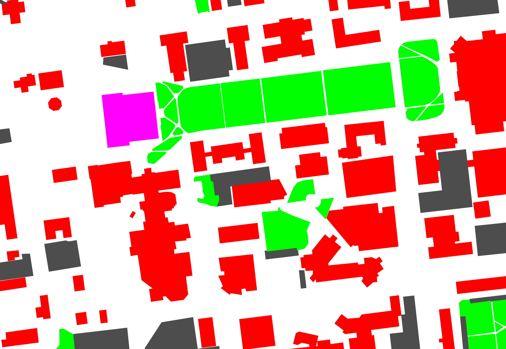

# OSM to SDF converter for Gazebo
	
	Author: Tashwin Khurana
    Edits by: Vikas Dhiman
	
	Version: 2.0
	
	Description: Open Street Maps plugin for Gazebo
	             This folder contains files for converting OSM maps to Gazebo simulator compatible SDF files.
	

## Dependencies:

	Python 3.10
    pip install -r requirements.txt


## Scripts and their roles
osm2dict.py

	Collects data about certain types of roads based on input coordinates from osm database and converts the information received to format that can be used to build sdf files.

dict2sdf.py

	Used to build sdf file from data received about the elements in the sdf format. 
	functionality: 
		add models to world, 
		add road element, 
		set road width, 
		add points to the road element

getMapImage.py

       Gets the image of the area required to be simulated.
       
getOsmFile.py

       Downloads the osm database of the specified area.

## Usage
gz_osm.py

       Command line compatible program which combine the functionality of all the above classes and functions to output the .sdf file for gazebo. 

	usage: gz_osm.py [-h] [-f OUTFILE] [-o OSMFILE] [-O INPUTOSMFILE]
	                 [-i IMAGEFILE] [-d DIRECTORY]
	                 [-B [BOUNDINGBOX [BOUNDINGBOX ...]]] [-r] [-m] [-b] [-a]
	                 [--interactive]
	
	optional arguments:
	  -h, --help            show this help message and exit
	  -f OUTFILE, --outFile OUTFILE
	                        Output file name
	  -o OSMFILE, --osmFile OSMFILE
	                        Name of the osm file generated
	  -O INPUTOSMFILE, --inputOsmFile INPUTOSMFILE
	                        Name of the Input osm file
	  -i IMAGEFILE, --imageFile IMAGEFILE
	                        Generate and name .png image of the selected areas
	  -d DIRECTORY, --directory DIRECTORY
	                        Output directory
	  -B [BOUNDINGBOX [BOUNDINGBOX ...]], --boundingbox [BOUNDINGBOX [BOUNDINGBOX ...]]
	                        Give the bounding box for the area Format: MinLon
	                        MinLat MaxLon MaxLat
	  -r, --roads           Display Roads
	  -m, --models          Display models
	  -b, --buildings       Display buildings
	  -a, --displayAll      Display roads and models
	  --interactive         Starts the interactive version of the program

## Test files:

Unit testing for each of the source files is provided in the testfiles/ folder.

Usage:

	Run gz_osm.py file

		$ python gz_osm.py 

                or 

                $ ./gz_osm.py [-h] [-f OUTFILE] [-o OSMFILE] [-i IMAGEFILE] [-d DIRECTORY]
	                 [-B [BOUNDINGBOX [BOUNDINGBOX ...]]] [-r] [-m] [-b] [-a][--interactive]
	
	Output file: outFile.sdf (default)

	Check the file on gazebo
		ign gazebo outFile.sdf
        

## Demo
1. Export OSM file using openstreetmaps.org Export button: 

    

2. For a demo, I exported University of Maine campus map to `testFiles/umaine.osm`
    
    
    
3. Run with `-a` to add all building, models and roads,
    
    ```bash
    gazebo_osm$ python3 gz_osm.py -a --inputOsmFile testFiles/umaine.osm --imageFile testFiles/umaine.png --outFile testFiles/umaine.sdf
    Downloading the osm data ... 
    Elapsed time is 0.28670549392700195 seconds.
    Extracting the map data for gazebo ...
    Parsing relation Name:  University Mall
    Elapsed time is 0.019033432006835938 seconds.
    Building the image file ...
    Elapsed time is 0.6773087978363037 seconds.
    Building sdf file ...
    Found loops in  footway_143862338
    Elapsed time is 0.22879910469055176 seconds.
    ```
4. The image is generated using matplotlib
    
    
    
6. I tested it under `ign gazebo` version 6.16 (Fortress) on Ubuntu 22.04
       (Jammy).
    
    ```bash
   
    gazebo_osm$ ign gazebo -v4 testFiles/umaine.sdf
    ```
    
    
